<a href="https://github.com/monyx-nuked/monyx-nuked/">
  
</a>

## Hi There! I'm `monyx`

[](https://nixos.org)
[](https://discord.com/users/938080309730246677)
[](https://t.me/monyx_nuked)


### 🔎 About Me
I'm `monyx` (he/him) - I'm a guy who just returned to programming after 1 year. I'm interested in making projects and learning languages, aiming to be a *Coder* Master!

> I'm currently heavily interested in [Nix and NixOS](https://nixos.org)</br>
> I'm muslim (I'm trying my best to pray on time :)

<p align="left">📃 Info about me</p>

```nix
{
  monyx = {
    age = 14;
    pronouns = [ "he" "him" ];
    locale = [ "uz_UZ" "en_US" "ru_RU" ];
    skills = [ "English" "Nix" "HTML" "CSS" "JavaScript" "Python" "NeoVim" ];
  };
}
```

<br>

______________________________________________________________________

<br>

<p align="center">
  <a href="https://skillicons.dev">
    
  </a>
</p>

<p align="left">🎁 Metrics</p>
<h4 align="right">My metrics</h6>
<picture>
  
</picture>
<h4 align="right">Isocalendar - full-year</h6>
<picture>
  
</picture>
<h4 align="right">Featured Repositories</h6>
<picture>
  
</picture>
<h4 align="right">Starred Topics</h6>
<picture>
  
</picture>
<h4 align="right">Most Used Languages</h6>
<picture>
  
</picture>


<p align="left">📦 Github Stats</p>
<h4 align="right">Stats Card</h6>

<h4 align="right">Repo Pins</h6>
<a href="https://github.com/monyx-nuked/monyx-nuked"></a>
<!-- <h4 align="right">Top Languages Used</h6>
 -->

<p align="left">🔗 Credits</p>
<ul>
  <li>The icons/badges are provided by <a href="https://shields.io">shields.io</a></li>
  <li>Github Stats are provided by <a href="https://github.com/anuragharza/github-readme-stats">Anurag's Github Stats</a></li>
  <li>Discord Status provided by <a href="https://github.com/cnrad/lanyard-profile-readme">Lanyard</a></li>
  <li>Metrics provided by <a href="https://github.com/lowlighter/metrics">Metrics</a></li>
  <li>Counter at the right by <a href="https://count.getloli.com">Moe Counter</a></li>
</ul>

______________________________________________________________________

<h6 align="center">
Last update in <code>16 March 2026</code>
</h6>
